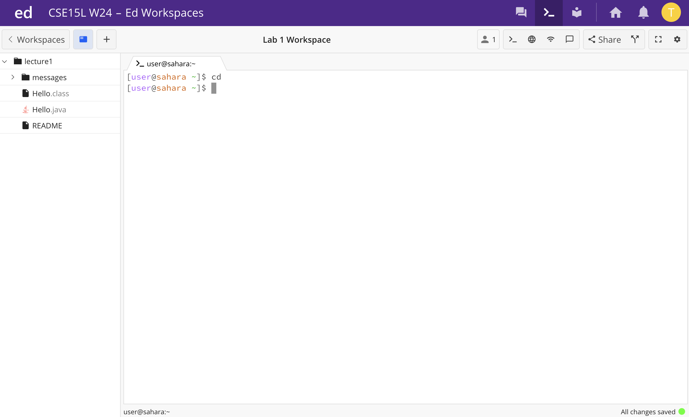

Lab 1
---	
## command `cd`
1. An example of using the command with no arguments:

2. An example of using the command with a path to a directory as an argument:

3. An example of using the command with a path to a file as an argument:

## command `ls`
1. An example of using the command with no arguments:

2. An example of using the command with a path to a directory as an argument:

3. An example of using the command with a path to a file as an argument:

## command `cat`
1. An example of using the command with no arguments:

2. An example of using the command with a path to a directory as an argument:

3. An example of using the command with a path to a file as an argument:
