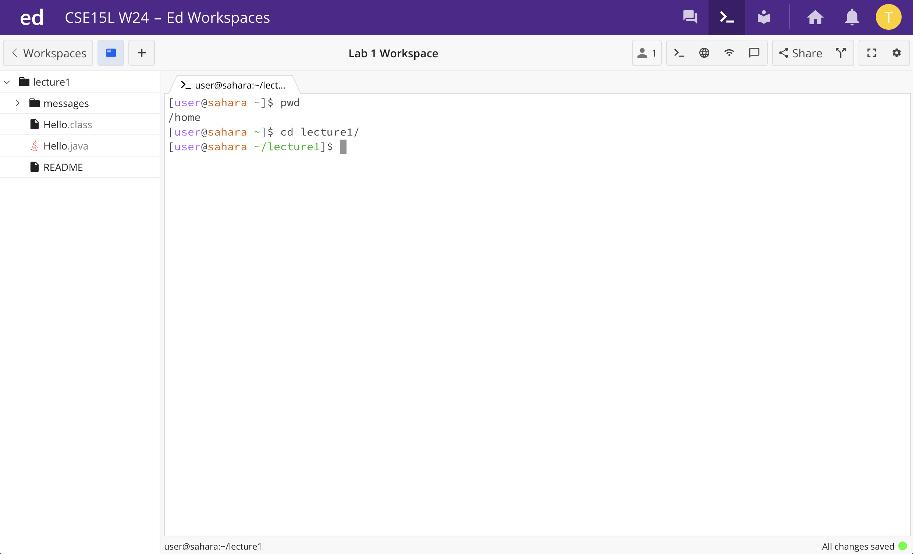

Lab 1
---	
## command `cd`
1. An example of using the command with no arguments:

Working directory: Before the command was run, `\home` was the working directory. After the command was run, the working directory didn't change.

Why I got this output: The command `cd` requires an argument, which would specify what directory to change to, and if there's no argument, the directory can't be changed since no new directory is specified. The command `cd` anyways doesn't output anything however, but in the next line, you can see that the directory hasn't changed from `\home`. 

Error: none

2. An example of using the command with a path to a directory as an argument:

Working directory: Before the command was run, `\home` was the working directory. After the command was run, the working directory changed to `/home/lecture1`.

Why I got this output: The command `cd` requires an argument, which is `lecture1\` here. The command `cd` anyways doesn't output anything however, but in the next line, you can see the new directory. 

Error: none

3. An example of using the command with a path to a file as an argument:

## command `ls`
1. An example of using the command with no arguments:

2. An example of using the command with a path to a directory as an argument:

3. An example of using the command with a path to a file as an argument:

## command `cat`
1. An example of using the command with no arguments:

2. An example of using the command with a path to a directory as an argument:

3. An example of using the command with a path to a file as an argument:
