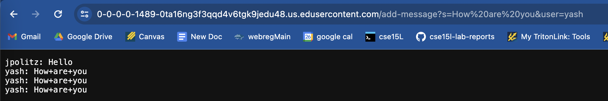
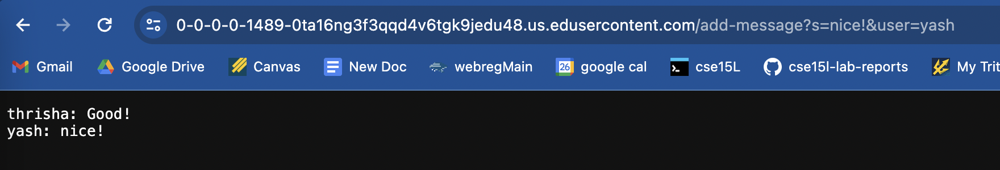
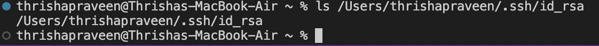
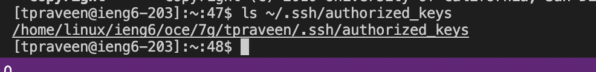
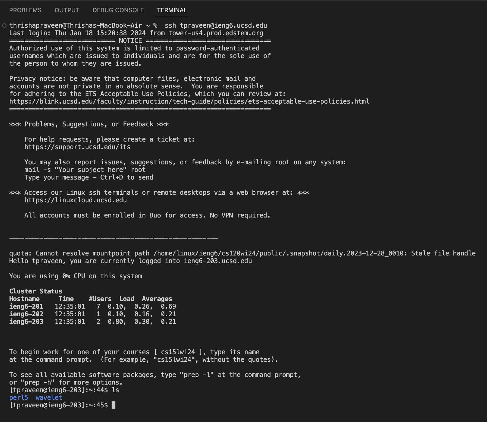

Part 1
=========	

ChatServer code:
```
import java.io.IOException;
import java.net.URI;
import java.util.*;


class Handler implements URLHandler {

    ArrayList<String> chatHistory = new ArrayList<String>();

    public String handleRequest(URI url) {
        if (url.getPath().equals("/add-message")) {
            System.out.println("in first if");
            String[] parameters = url.getQuery().split("&");
            String[] messageInput = parameters[0].split("=");
            String[] userInput = parameters[1].split("=");
            if (messageInput[0].equals("s") && userInput[0].equals("user")) {
                System.out.println("in second if");
                String messageEntry = userInput[1] + ": " + messageInput[1] + "\n";
                chatHistory.add(messageEntry);
            }
        } 
        else {
            return "404 Not Found!";
        }

        String output ="";
        for (String entryString: chatHistory) {
            output += entryString;
        }
        return output; 
    }
}
class ChatServer {
    public static void main(String[] args) throws IOException {
        if(args.length == 0){
            System.out.println("Missing port number!");
            return;
        }
        int port = Integer.parseInt(args[0]);
        Server.start(port, new Handler());
    }
}
```

First screenshot:
---------	



Which methods in your code are called?
The first method that is called in my code is the main method in the ChatServer class, which sets up what port the server will be running on. 

What are the relevant arguments to those methods, and the values of any relevant fields of the class?


How do the values of any relevant fields of the class change from this specific request? If no values got changed, explain why.


Second screenshot:
---------	



Which methods in your code are called?


What are the relevant arguments to those methods, and the values of any relevant fields of the class?


How do the values of any relevant fields of the class change from this specific request? If no values got changed, explain why.


Part 2
=========	
The absolute path to the private key for your SSH key for logging into ieng6 (on your computer, an EdStem workspace, or on the home directory of the lab computer)



The absolute path to the public key for your SSH key for logging into ieng6 (this is the one you copied to your account on ieng6, so it should be a path on ieng6's file system)



A terminal interaction where you log into your ieng6 account without being asked for a password.



* when I type in `ssh tpraveen@ieng6.ucsd.edu` into my terminal on Visual Studio Code, it allows me to log into my ieng6 without it asking for my password. As you can see when I type in the `ls` command, I have access to two directories/folders that are available in my remote account.

Part 3
=========	
Something I learned from lab in week 2 or 3 that you didn't know before:
