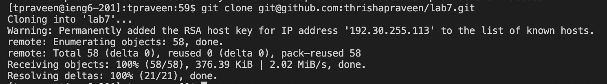
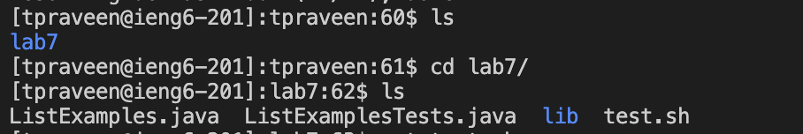
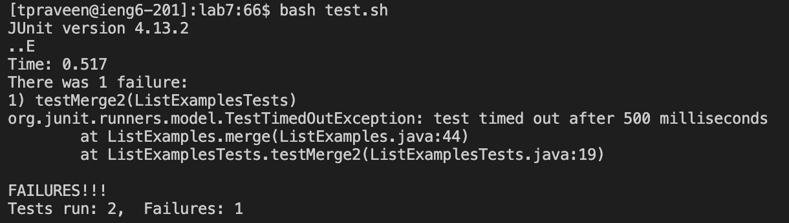
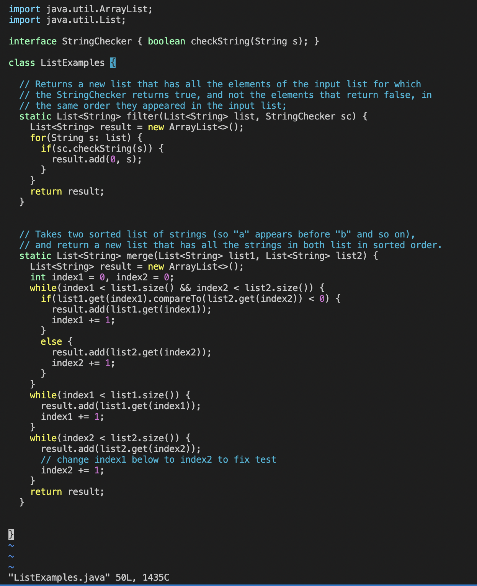
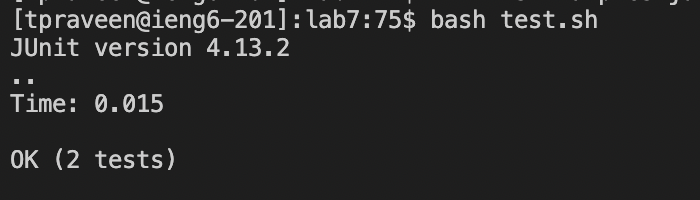
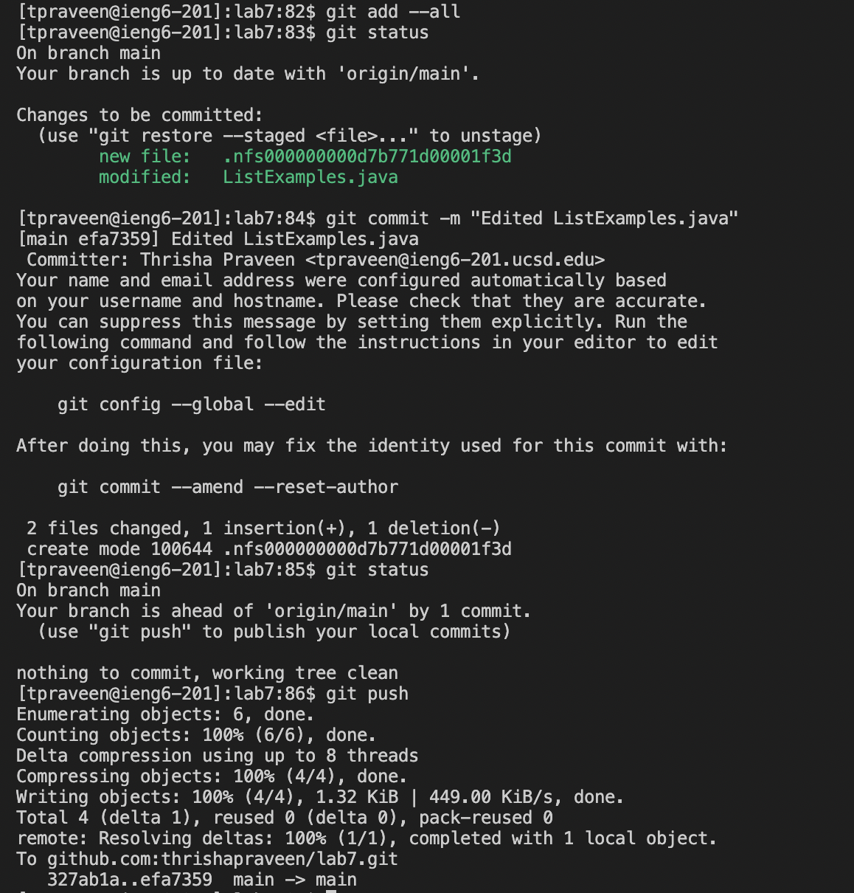

Step 4:
---------	

__Screenshot__: 

__Keys pressed to get to this step__: `ssh tpraveen@ieng6-201.ucsd.edu <enter>`, then: `cs15lwi24 <enter>`

__Summary of commands and effect of keypresses__: These steps allowed me to log into my ieng6 machine (without a passcode) and work on a specific course. 

Step 5:
---------	

__Screenshot__: 

__Keys pressed to get to this step__: `git clone git@github.com:thrishapraveen/lab7.git <enter>`

__Summary of commands and effect of keypresses__: Since my SSH key is connected to my GitHub account, I can clone the repository I forked to my GitHub to my ieng6 machine using `git clone` on the SSH key from GitHub for the repo of interest. This will allow me to make changes to the cloned directory from the command line. 

Step 6:
---------	

__Screenshot__: 

__Keys pressed to get to this step__: `ls <enter>`, then: `cd lab <tab>`, which gave me `lab7/`, then: `<enter>`, then: `ls <enter>`, then: `bash test.sh <enter>`

__Summary of commands and effect of keypresses__: The `ls` command helps me see where I am in the directory. The output being the `lab7` directory prompted me to `cd` into that directory to run the bash script and use `ls` to check what files are in `lab7`. I then ran the bash script that compiles the relevant files and runs the test file using the `bash` command on the `test.sh` file. This will allow me to see whether the tests failed or not. As seen in the screenshot, one of the tests that was in the `ListExamplesTests` file failed, which was expected. Looking at the failure further, we can see that it was the second test that failed.

Step 7:
---------	

__Screenshot__: This screenshot shows how `ListExamples.java` looks after the edit was made.

__Keys pressed to get to this step__: 
vim ListE `<tab>`, which gave me `vim ListExamples`, then I typed `.java`.

`i` to switch to insert mode.

`<down>` 43 times to get cursor to the line 43 that says `index1+=1` in the while loop that checks if `index2` is less than `list2.size()`.

`<right>` 12 times to get cursor to space after `index1`.

`<delete>` to delete `1` from `index1`.

`2` to change the variable name to be index2 instead of index1.

`<shift> :wq! <enter>` which saved the changes and quit vim.

__Summary of commands and effect of keypresses__: Using just my keyboard and no mouse, I could edit the file using vim to allow the `ListExamples.java` file to pass all the tests written in `ListExamplestests.java`. I was then able to save my edits and quit out of vim to go back to the terminal. 

Step 8:
---------	

__Screenshot__: 

__Keys pressed to get to this step__: `bash test.sh <enter>`

__Summary of command and effect of keypresses__: I ran the tests again by running the bash script (`test.sh`) using the `bash` command, and the output in the terminal shows that, now, both tests passed after the edit was made via the vim command from step 7.

Step 9:
---------	

__Screenshot__:

__Keys pressed to get to this step + summary/effect__: `git add --all <enter>` added the changes made to the file to the repository. I used `git status <enter>` to check what changes needed to be committed. `git commit -m "Edited ListExamples.java" <enter>` committed (or saved) the changes made with a comment specifying what happened. `git push <enter>` shares the changes made to the remote repository made so that other developers can see what was changed. 
