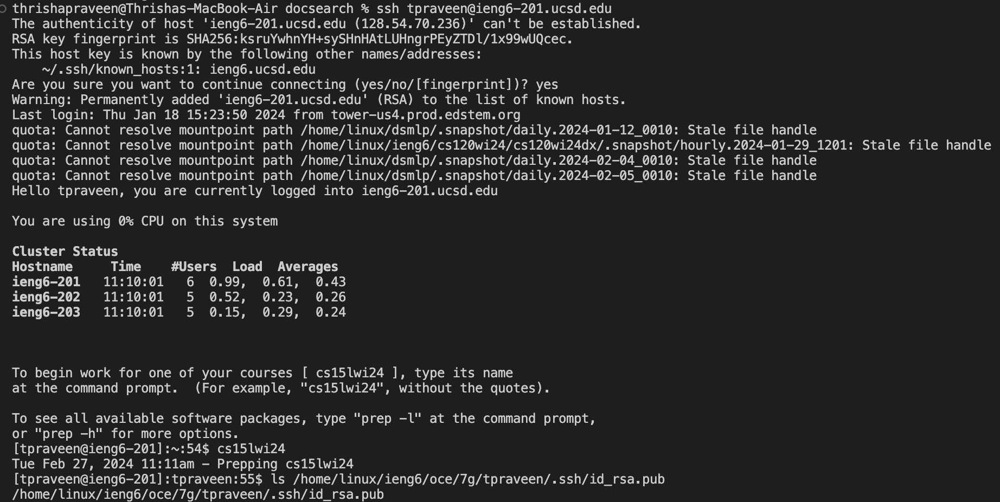

Step 4:

Screenshot: 

Keys pressed to get to this step: ssh tpraveen@ieng6-201.ucsd.edu `<enter>`, then cs15lwi24 `<enter>`

Summary of command and effect of keypresses: These steps allowed me to log into my ieng6 machine (without a passcode) and work on a specific course. 

Step 5:

Screenshot: 

Keys pressed to get to this step: git clone git@github.com:thrishapraveen/lab7.git `<enter>`

Summary of command and effect of keypresses: Since my SSH key is connected to my GitHub account, I can clone the repository I forked to my GitHub to my ieng6 machine using `git clone` on the SSH key from GitHub for the repo of interest. This will allow me to make changes to the cloned directory from the command line. 

Step 6:

Screenshot: 

Keys pressed to get to this step:

Summary of command and effect of keypresses:

Step 7:

Screenshot:
Keys pressed to get to this step:
Summary of command and effect of keypresses:

Step 8:

Screenshot:
Keys pressed to get to this step:
Summary of command and effect of keypresses:

Step 9:

Screenshot:
Keys pressed to get to this step:
Summary of command and effect of keypresses:
